Esta documentación corresponde a la creación de mi página web para el curso y la edición del apartado “About”.

El primer paso para crear esta web fue instalar y configurar Git. Yo ya tenía cuenta de github pero estaba usando github desktop + codex de OpenAI para otros proyectos.
Instalé Git siguiendo el tutorial de Moodle “2 - Instalar y configurar Git en tu pc” y me aseguré que los datos quedaron correctos.

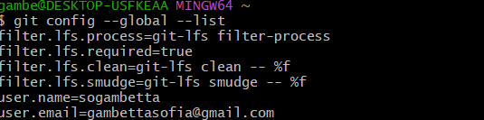

El siguiente paso fue generar una SSH KEY para lo que usé el tutorial “Generar una ssh key en GitHub”

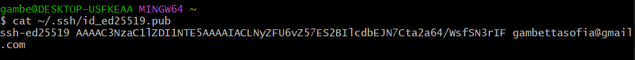

Luego agregué la key a github.

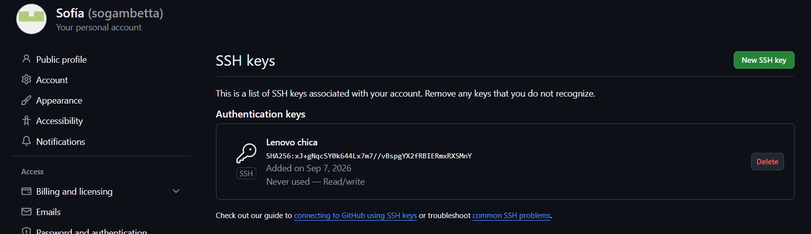

El paso siguiente fue copiar el proyecto del template de EFDI usando el botón Fork, que hace un clon y lo deja en mi repositorio.

Usando la terminal de Bash creé una carpeta en documents de mi pc que se llama “hola”. Luego cambié el nombre a “sofi_page” que es el que estoy usando actualmente.

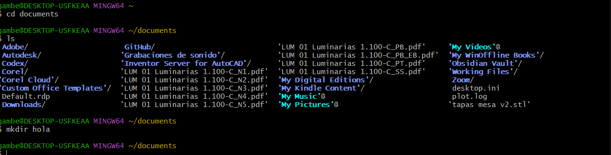

Una vez creada la carpeta cloné el repositorio localmente.

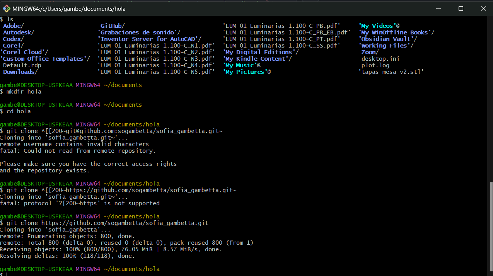

Para continuar con el proyecto fui al README que está en el repositorio para asegurarme que tenía todo configurado correctamente. Tuve que instalar python porque python –-version no me devolvía nada

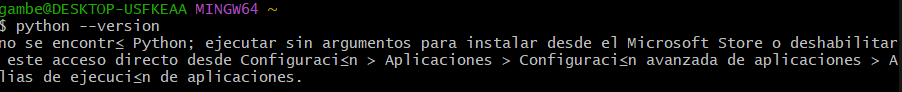
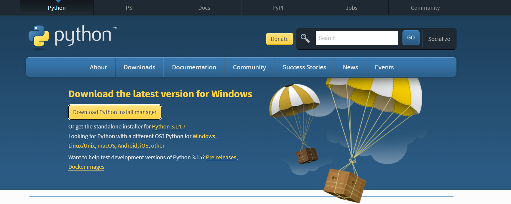

Una vez instalado estamos ok

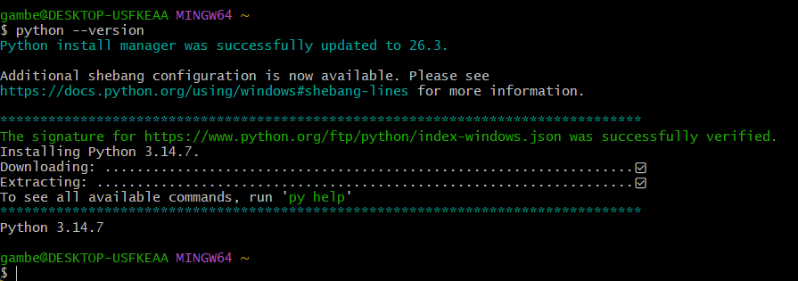

Hice el upgrade de pip.
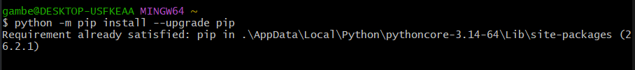
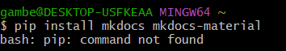

Le pregunté a chat gpt porqué no me funciona pip que lo necesitaba para usar mkdocs para tener mi servidor local y ver los cambios antes de hacer commit.

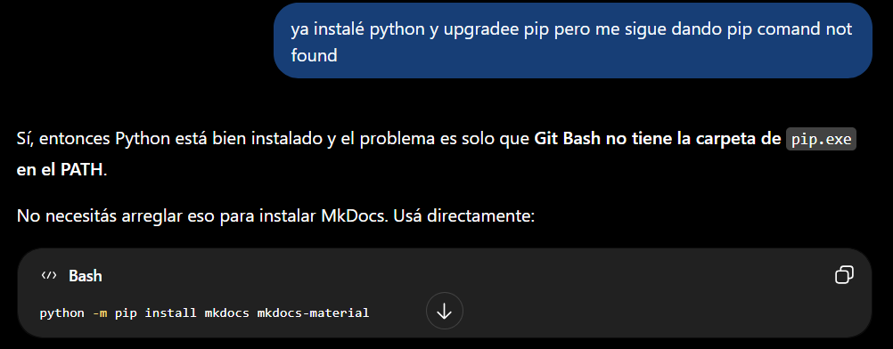
Tomé el consejo y me dió algunos warnings que según chat gpt no eran de entidad, a chequear en el futuro.

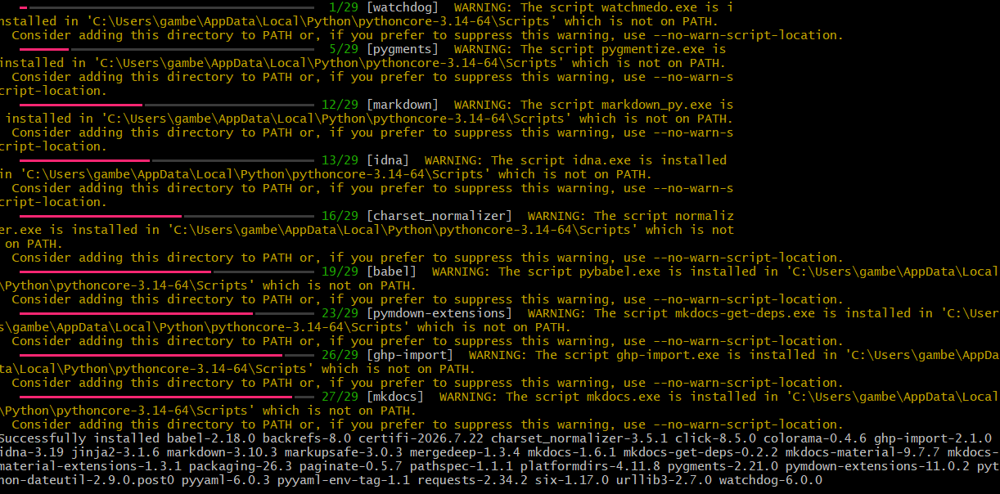

Una vez hecho esto consulté cómo acceder al servidor local usando mkdocs, lo habíamos visto en clase pero no lo recordaba. Esto me dio un error que volví a consultar.

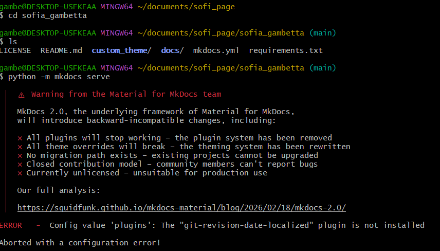

Le mandé una captura de las carpetas y estructura del proyecto y me dijo que lo mejor era seguir las instrucciones dentro de esos requirements.

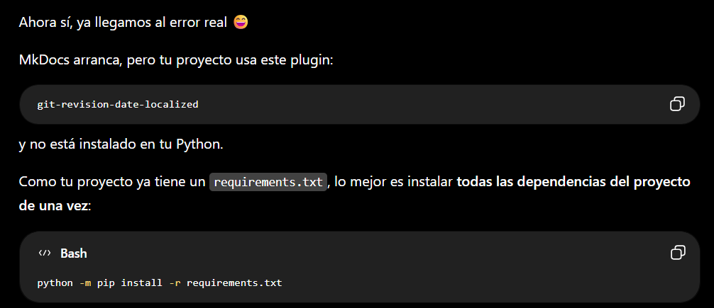

Instalé los requerimientos siguiendo el consejo y ahora funcionó el servidor local.

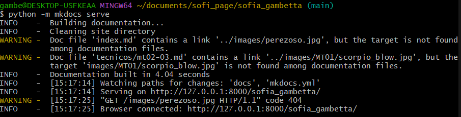

Una vez corriendo el servidor local usé Visual Studio Code para abrir la carpeta del proyecto y poder editar las páginas.
Una vez abierto edité el archivo me.md usando el editor de texto y el visualizador para ver cómo quedaba.

Agregué al final una foto de mis gatitos y apareció un problema que me llevó unos **40 minutos** resolver y dejo un meme de mi situaciòn en ese momento:

**El problema:** La foto se veía en Visual Studio Code pero no aparecía en el servidor local.
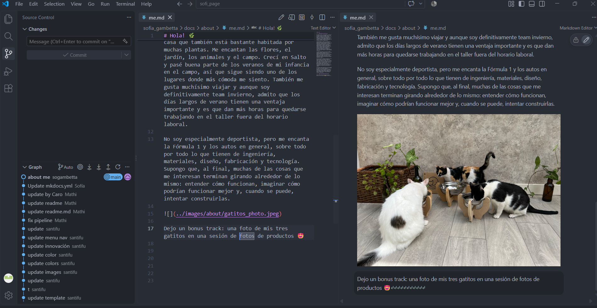
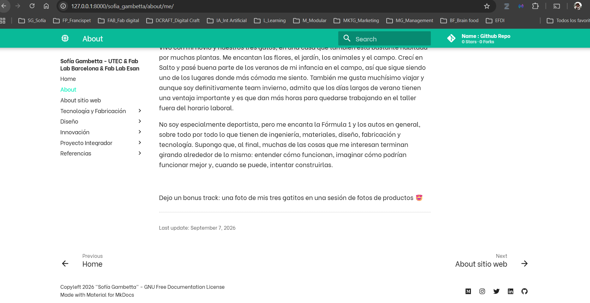

Volví a consultar con chat gpt y exploramos juntos varias cosas. Para hacerlo más sencillo le pedí a la propia IA que me haga un resumen de las exploraciones y lo que fuimos encontrando para no tener que pegar todo el chat.

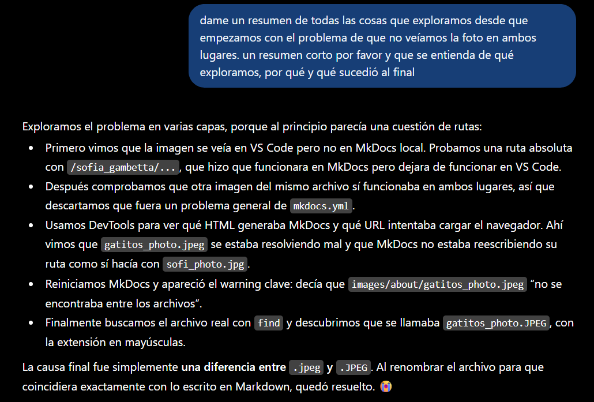

El resultado final fue cambiar la ruta del archivo y funcionó perfectamente y quedó la página lista. 

**Moraleja:** a veces la solución es más sencilla de lo que parece y la IA se enrosca más de lo necesario.
