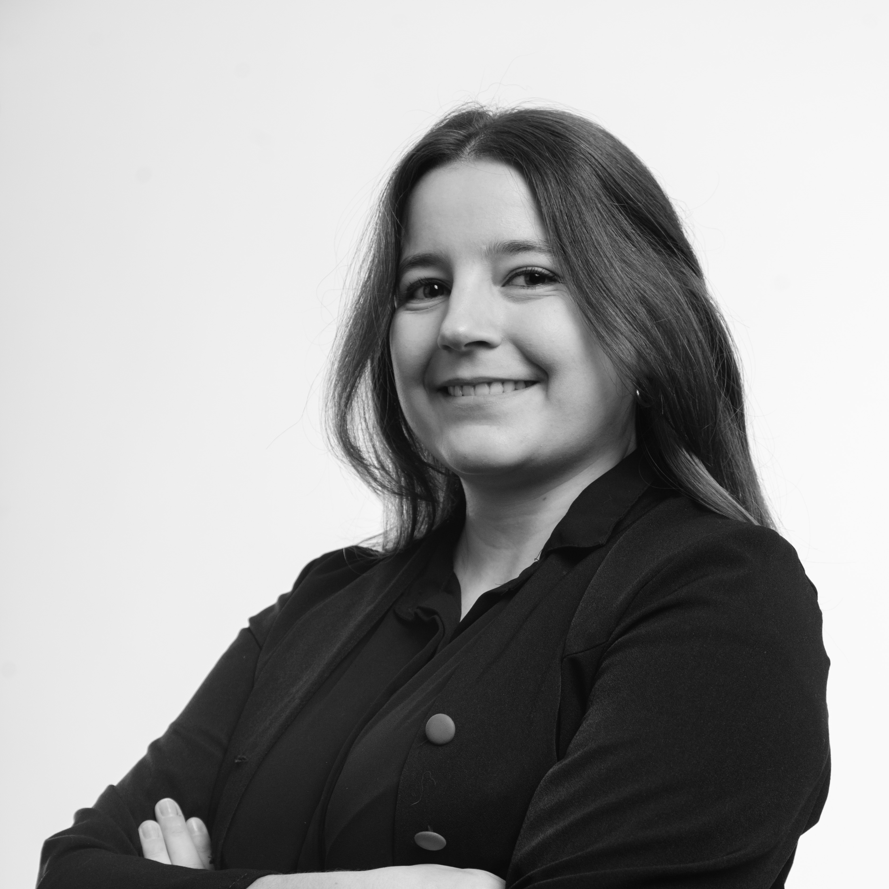
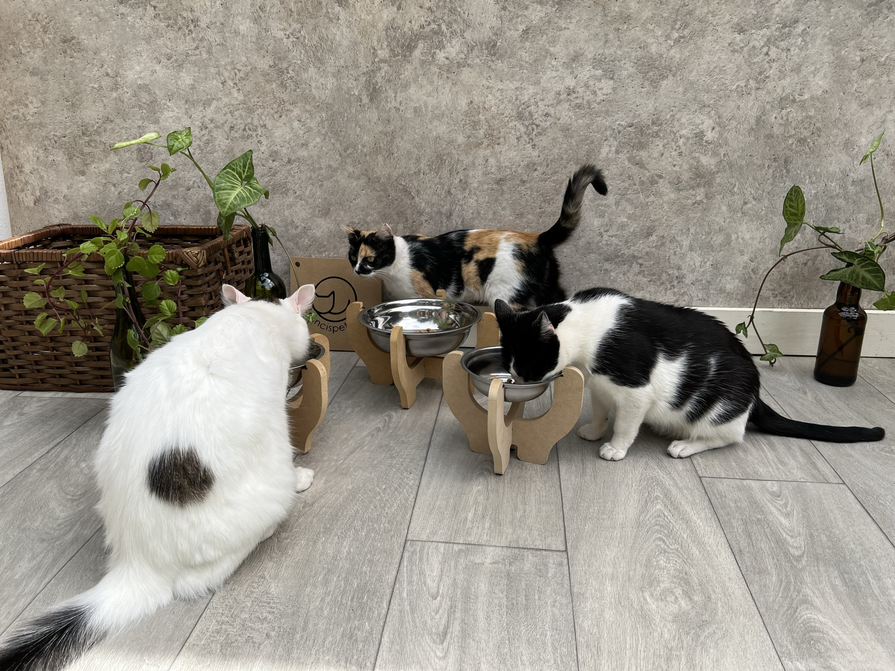

# Hola! 🌿

Mi nombre es Sofía. Soy arquitecta, curiosa por naturaleza y muy fan de entender cómo se hacen las cosas. Estudié en la Udelar, hice el posgrado en Construcción de Obras también en la Udelar y más adelante cursé Arquitectura y Tecnología en la Universidad Torcuato Di Tella en Argentina. En algún momento también hice Jóvenes a Programar, donde aprendí HTML, que fue una de mis primeras entradas al mundo de la tecnología fuera de la arquitectura.

Profesionalmente, trabajo en una empresa que desarrolla proyectos de arquitectura para Estados Unidos. Hasta hace poco fui Directora de Fabricación, liderando proyectos vinculados a fabricación digital, DfMA y construcción industrializada. Actualmente soy Directora de Applied Research y lidero un grupo dedicado a explorar cómo la tecnología puede ayudar a resolver problemas reales de la industria y de nuestros clientes. También trabajo en la Facultad de Arquitectura de la Udelar como secretaria académica de los posgrados de Construcción, colaborando en la organización de cursos, contenidos, docentes y nuevas propuestas académicas.

La fabricación digital es uno de mis grandes intereses. Tengo un pequeño taller en casa donde fabrico prototipos y productos para mi emprendimiento de mobiliario para gatos. En general, me gusta mucho hacer cosas, parte de la razón por la que elegí la casa donde vivo fue porque tiene un espacio para taller. Desde entonces hice muebles, instalaciones, arreglos y experimentos varios para mi casa y para las de familiares y amigos.

Vivo con mi novio y nuestros tres gatos, en una casa que también está bastante habitada por muchas plantas. Me encantan las flores, el jardín, los animales y el campo. Crecí en Salto y pasé buena parte de los veranos de mi infancia en el campo, así que sigue siendo uno de los lugares donde más cómoda me siento. También me gusta muchísimo viajar y aunque soy definitivamente team invierno, admito que los días largos de verano tienen una ventaja importante y es que dan más horas para quedarse trabajando en el taller fuera del horario laboral.

No soy especialmente deportista, pero me encanta la Fórmula 1 y los autos en general, sobre todo por todo lo que tienen de ingeniería, materiales, diseño, fabricación y tecnología. Supongo que, al final, muchas de las cosas que me interesan terminan girando alrededor de lo mismo: entender cómo funcionan, imaginar cómo podrían funcionar mejor y, cuando se puede, intentar construirlas.

Dejo un bonus track: una foto de mis tres gatitos en una sesión de fotos de productos 😍

